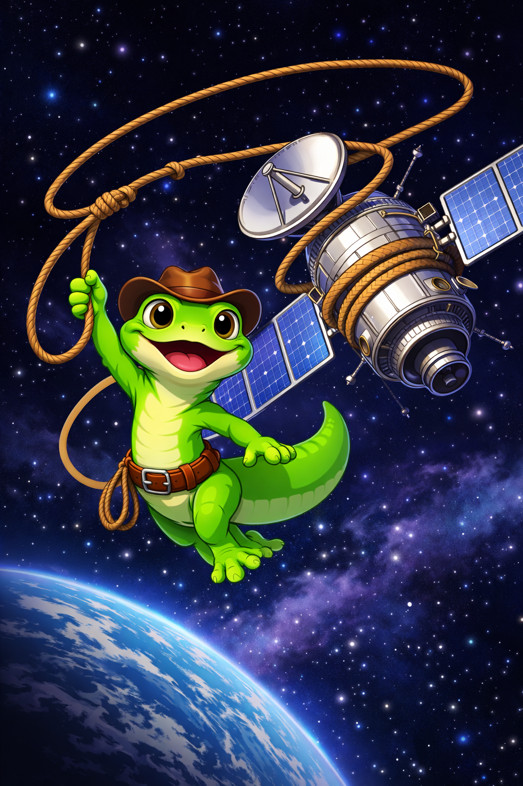

# Gecko Lasso Simulation

<p align="center">
  
</p>

<p align="center">
  <em>MuJoCo-based simulation of a cable wrapping, capturing, and detumbling a satellite in orbit</em>
</p>

---


## Overview

This simulator models an acquisition vehicle (AV) using a lasso to capture and detumble a spinning satellite in orbit. The intent is for the end of the lasso to adhere to the satellite with a piece of gecko-inspired adhesive. The simulation uses the [MuJoCo](https://mujoco.org/) physics engine to model the full cable-satellite contact dynamics, including:

- **Cable dynamics** -- a discretized cable modeled as point masses connected by spring-damper tendons
- **Cable-satellite contact** -- frictional contact between cable nodes and the satellite mesh
- **Node freezing** -- cable nodes that come to rest on the satellite surface are automatically welded to the satellite body, reducing computational time
- **Dynamic cable length management** -- nodes are spawned and despawned from a spool on the AV as the length of cable changes
- **AV thruster response** -- a configurable thruster reaction function that responds to cable tension
- **Adaptive recompilation** -- the MuJoCo model is dynamically recompiled to only simulate active degrees of freedom, maintaining a reasonable computational cost

## Installation

Requires Python 3.8+.

```bash
pip install mujoco numpy matplotlib trimesh
```

## Usage

Run the simulation with default parameters:

```bash
python GeckoLassoSim.py
```

The simulation launches an interactive MuJoCo viewer showing the satellite, AV, and cable. An on-screen overlay displays initial parameters (rotation axis, angular velocity, cable tension, positions, masses) and live stats (simulation time, thruster force).

### Programmatic Use

The `Simulation` class can be instantiated with custom parameters:

```python
from GeckoLassoSim import Simulation

sim = Simulation(
    sat_omega=2,                    # Initial satellite spin rate (rad/s)
    sat_rotation_axis=(0, 0.02, 1), # Spin axis in satellite body frame
    cable_tension=10,               # Free link tension (N)
    cable_stiffness=7000,           # Inter-node spring stiffness (N/m)
    cable_seg_len=0.5,              # Rest length between nodes (m)
    time_step=0.00005,              # Integration timestep (s)
)

# Step the simulation forward
sim.step()

# Access state
print(sim.data.time)        # Current sim time
print(sim.active_count)     # Number of active cable nodes
print(sim.anchor_idx)       # Index of first node in physics model
```

### Profiling

A profiling script is included to benchmark simulation performance:

```bash
python profile_sim.py
```

## Configuration

Visual and computational parameters are configured via constants at the top of `GeckoLassoSim.py`:

| Parameter | Description                                                                      |
|---|----------------------------------------------------------------------------------|
| `ENABLE_RECOMPILE` | Toggle adaptive model recompilation for performance                              |
| `RECOMPILE_BUFFER` | Number of extra inactive segments added per recompile                            |
| `UNDAMPED_LATERAL_NODES_BEFORE_SAT` | Number of nodes near the satellite left without damping in the lateral direction |
| `CONTACT_SOLREF_STIFFNESS` | Contact spring stiffness scaling factor                                          |
| `CONTACT_SOLIMP` | MuJoCo contact impedance parameters                                              |

## Project Structure

```
GeckoLassoPythonSim/
  GeckoLassoSim.py           # Main simulation code
  profile_sim.py             # Profiling script
  Assets/                    # 3D meshes (.obj) and textures (.png)
  ArchivedCode/              # Old/reference implementations
```

## License and Authorship
Developed by Matthew Coughlin for the [Biomimetics and Dexterous Manipulation Lab (BDML)](https://bdml.stanford.edu/) research group at Stanford University.
 
All rights reserved.
